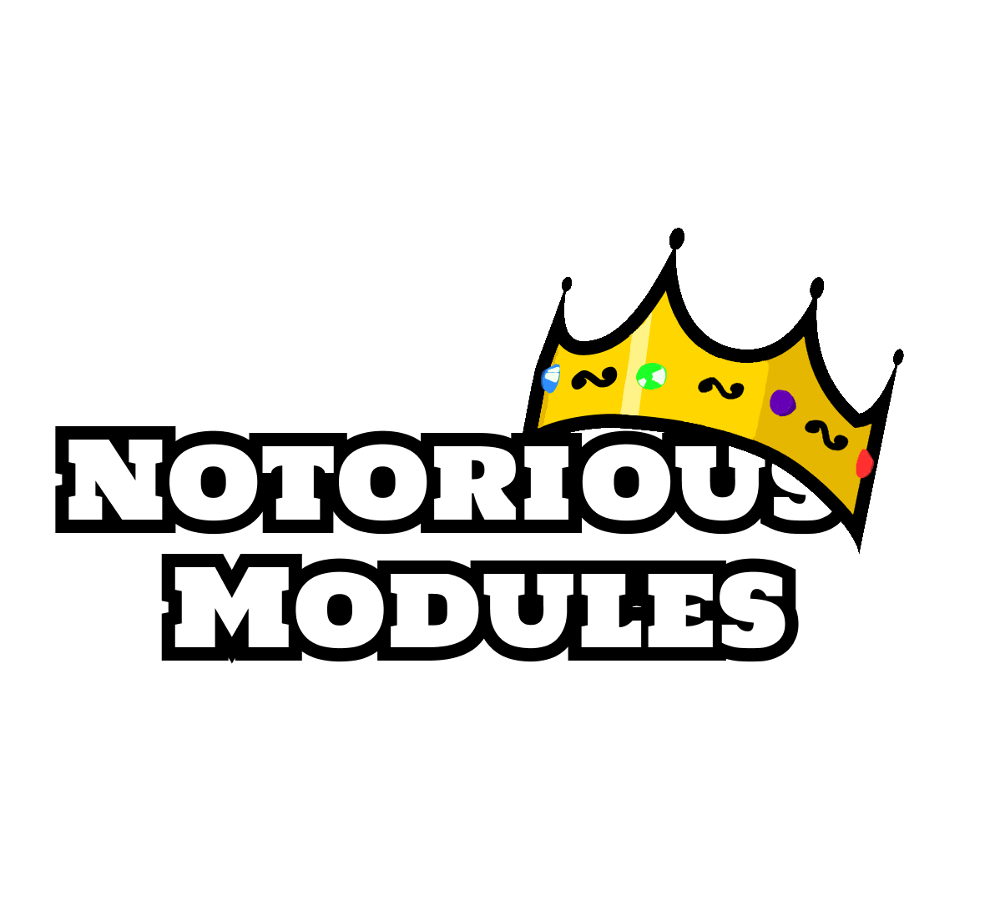
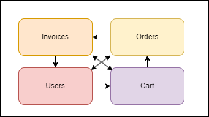

## 

**Notorious Modules** provide a simple way to separate monolith into standalone modules.

## Summary

- [Support](#support)
- [Features](#features)
- [Motivation](#motivation)
- [Getting started](#getting-started)
- [Modules](#modules)
  - [What's a modules](#whats-a-module)

## Support

- Net6+

## Features

- Modules separation
- Automatic injection
- Global endpoints configuration
- Easy modular monolith architecture
- Based on net minimal apis

## Motivation

The goal is to provide a way to separate applications into modules that can be moved at anytime without any pain.
Based on Module monolith architecture.

## Getting Started

First, [install NuGet](http://docs.nuget.org/docs/start-here/installing-nuget). Then, install [NotoriousTest](https://www.nuget.org/packages/NotoriousTest/) from the package manager console:

```
PM> Install-Package NotoriousModules
```

Or from the .NET CLI as:

```
dotnet add package NotoriousModules
```

## Modules

### What is a module ?

A module can be seen as an independent components with well-defined functionnal boundaries. It group together related functionnalities.

For example, in a basic e-commerce applications, we could have a modules for invoices functionnalities, orders, users, and cart.



### How to implement modules

**Notorious Modules** provide a base class for modules :

```csharp
public class ExampleModule : NotoriousModules.Modules
{
    public override string ModuleName => "Example";

    public ExampleModule() : base()
    {
    }

    protected override void ConfigureModuleEndpoints(RouteGroupBuilder routeGroupBuilder)
    {
        base.ConfigureModuleEndpoints(routeGroupBuilder);

		// Here you can configure your endpoints
		AddPostEndpoint("orders", async ([FromServices] GetOrdersFeature feature, [FromBody] GetOrdersParams @params) =>
		{
			return await feature.Handle(@params);
		});

    }

    protected override void ConfigureDependencyInjection(IServiceCollection services, IConfiguration configuration)
    {
        base.ConfigureDependencyInjection(services, configuration);
		// Here you can configure your dependency injection.
    }

    protected override void ConfigureApp(WebApplication app)
    {
		base.ConfigureApp(app);
		// Here you can configure your middlewares
    }

	protected override void ConfigureEachEndpoint(IEndpointConventionBuilder routeHandlerBuilder)
	{
		base.ConfigureEachEndpoint(routeHandlerBuilder);

		// Here you can configure every endpoint.
		// For example, lets configure OpenApi :
		routeHandlerBuilder
			.WithTags(ModuleName)
			.WithOpenApi();
	}
}
```

**Module** provide several method that u could override.

Use _**ConfigureModuleEndpoints**_ with _AddEndpoint_, _AddPostEndpoint_, _AddGetEndpoint_, _AddPutEndpoint_, _AddDeleteEndpoint_ or _AddPatchEndpoint_ to configure your minimal apis.

Use _**ConfigureDependencyInjection**_ to configure the application injection container.

Use _**ConfigureApp**_ to configure modules middlewares.

Use _**ConfigureEachEndpoint**_ to configure every endpoint of a module.

## Configure application to use modules

In your **Program.cs**, you will need to register every modules :

```csharp
// IServiceCollection AddModules(this IServiceCollection services, IConfiguration configuration, params Assembly[] assemblies)
builder.Services.AddModules(builder.Configuration, Orders.AssemblyMarker.Get(), Cart.AssemblyMarker.Get());
```

Pass-in assemblies that contains modules, they will be automatically retrieved and used.

> :information: You can't add constructor parameters to modules.

Then, you just need to use theses modules :

```csharp
var app = builder.Build();
app.UseModules();
```

And that's it, now u can create an infinite number of modules or extend module to create your own base modules.

For example, here's one module that integrate Swagger UI :

```csharp
public abstract class OpenApiModule : Module
{
    public OpenApiModule() : base()
    {
    }


    protected override void ConfigureEachEndpoint(IEndpointConventionBuilder routeHandlerBuilder)
    {
        base.ConfigureEachEndpoint(routeHandlerBuilder);

        routeHandlerBuilder
            .WithTags(ModuleName)
            .WithOpenApi();
    }
}

public class ExampleModule : NotoriousModules.OpenApiModule
{
    public override string ModuleName => "Example";

    public ExampleModule() : base()
    {
    }

    ...
}
```
